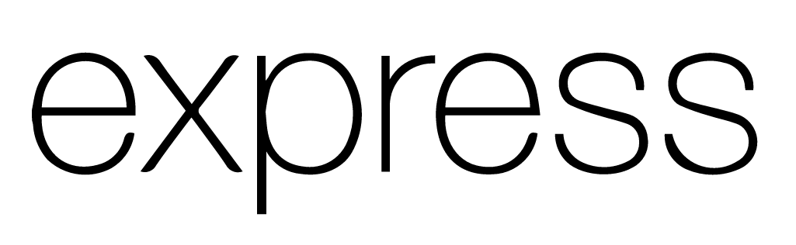

### Hi there 👋

## I'm Atishay Jain
---

## About Myself

- 👨‍🎓 I’m undergraduate pursuing B.Tech in Chemical  Engineering at Indian Institute of Technology, Guwahati.

---

<h3 align="left">Languages and Tools:</h3>

 

 

 

 

 

 

 
 
 
 
 

 

 

<!--  -->
 

 

---
#### Profile Visits

 

---

### Github Stats

 

 

---

### :mailbox: Reach me out!
   

---

<!--
**atishay1743/atishay1743** is a ✨ _special_ ✨ repository because its `README.md` (this file) appears on your GitHub profile.

Here are some ideas to get you started:

- 🔭 I’m currently working on ...
- 🌱 I’m currently learning ...
- 👯 I’m looking to collaborate on ...
- 🤔 I’m looking for help with ...
- 💬 Ask me about ...
- 📫 How to reach me: ...
- 😄 Pronouns: ...
- ⚡ Fun fact: ...
-->
